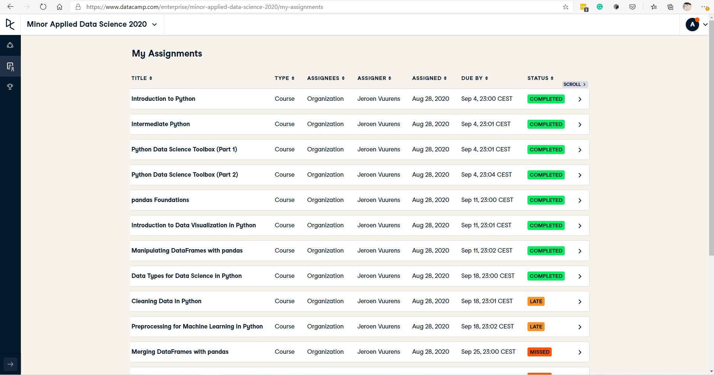

# portfolio
naam: Adnan Akbas
studentnummer: 17005116

## Project ActivPal

### Team members
- Ali
- Colin
- Mark
- Matthew

## Datacamp
  

 |Course|Statement of Accomplishment|
 |------|---------------------------|
 | Introduction to python |[proof](evidence/datacamp/introduction_to_python.pdf)|
 | Python Data Science Toolbox (Part 1) |[proof](evidence/datacamp/python_data_science_toolbox_part_1.pdf)|
 | Intermediate Python |[proof](evidence/datacamp/intermediate_python.pdf)|
 | Python Data Science Toolbox (Part 2) |[proof](evidence/datacamp/python_data_science_toolbox_part_2.pdf)|
 | Pandas Foundations |[proof](evidence/datacamp/pandas_foundations.pdf)|
 | Introduction to Data Visualization in Python |[proof](evidence/datacamp/introduction_to_data_visualization_in_python.pdf) |
 | Manipulating Dataframes with pandas |[proof](evidence/datacamp/manipulating_dataframes_with_pandas.pdf)|
 | Data Types for Data Science in Python |[proof](evidence/datacamp/data_types_for_data_science_in_python.pdf)|
 | Cleaning data in Python |[proof](evidence/datacamp/cleaning_data_in_python.pdf)|
 | Preprocessing for Machine Learning in Python |[proof](evidence/datacamp/preprocessing_for_machine_learning_in_python.pdf)|

### Research project

 
Task Definition

In the research plan I have written the second iteration of the problem domain/context while my teammates have worden on other parts. 
Where they have defined the research question among others. In the second iteration I have processed the feedback we got
from one of our teachers. 

``
Statistics Netherlands (CBS) has the wish to see if their respondents are moving for at least 150
minutes per week in moderately intense physical activity.
Currently, they are measuring by asking their respondent or health surveys. The issue with this is
that people are not very good at estimating the time they spent on moving and sport. This of course
causes that they don't have very reliable data to work with. Therefor CBS has been looking into
alternatives like the ActivPal accelerometer in combination with machine learning to give better and
more accurate results when measuring the intensity of certain activities.
Because of this the CBS started to collect lab tests and started to measure the movements of 41
correspondents in their regular workweek by using the Activepal Accelerator. It's our job to analyse,
structure and build machine learning algorithms based on the collected data to see if we can
determine if people adhere to (inter)national norm for physical activities and if we could measure
the intensity of movement (without the heart rate information).
``

src: [research_plan.pdf](evidence/documents/research_plan.pdf)

 
Evaluation

[More Examples](topics/research_project/evaluation.md)

 
Conclusions

[More Examples](topics/research_project/conclusions.md)

 
Planning

In our project the planning was done as group and not individually. That's why it's difficult to explain this as individual part.

At the beginning of our project we have decided that we will use Jira as our scrum board and will implement Scrum in our way and won't follow it to the detail.
Our group was based on trust that's also the reason why we didn't setup nor sign a contract for teamwork. 

Our process looked as following. At the start of each sprint we decided what goal is for the sprint. With this goal in mind we created task which each team member could choose and take it on themself.
The task can be modified, removed or created while the sprint were going onbut that was always first discussed within the group before any modification.
Each morning at 9:30 our group was holding a stand-up. There we discussed what we did day earlier, going to do today and if we are stuck with something.
At the end of each sprint our group was holding retrospective where we discussed our progress and teamwork last sprint. The role of scrum master was taken on by Ali Safdari.  

[In depth](topics/research_project/planning.md)

### Domain knowledge

 
Introduction of the subject field

[More Examples](topics/domain_knowledge/introduction_of_the_subject_field.md)

 
literature Research

[More Examples](topics/research_project/literature_research.md)

 
Explanation of Terminology, jargon and definitions

[More Examples](topics/research_project/explanation_of_terminology_jargon_and_definitions.md)

### Data preprocessing

 
Data exploration

[More Examples](topics/data_preprocessing/data_exploration.md)

 
Data cleaning

[More Examples](topics/data_preprocessing/data_cleaning.md)

 
Data preparation

[More Examples](topics/data_preprocessing/data_preparation.md)

 
Data visualization

[More Examples](topics/data_preprocessing/data_visualization.md)

### Predictive Analytics

 
selecting a model

[More Examples](topics/data_preprocessing/selecting_a_model.md)

 
training model

[More Examples](topics/data_preprocessing/training_model.md)

 
evaluating a model

[More Examples](topics/data_preprocessing/evaluating_a_model.md)

 
Visualizing the outcome of a model

[More Examples](topics/data_preprocessing/visualizing_the_outcome_of_a_model.md)

 
configuring a model

[More Examples](topics/data_preprocessing/configuring_a_model.md)

### communication

 
presentation

[More Examples](topics/data_preprocessing/presentation.md)

 
writing paper

[More Examples](topics/data_preprocessing/writing_paper.md)

